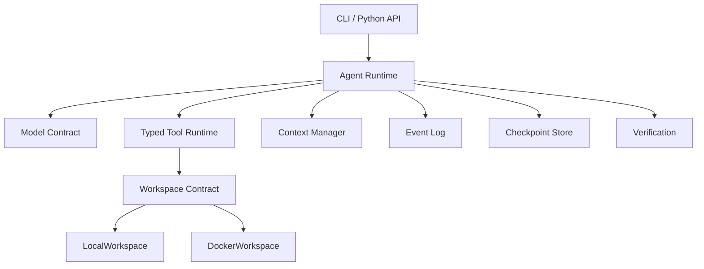

<p align="center">
  
</p>

<h1 align="center">CodeKeel</h1>

<p align="center">
  A small, inspectable, and extensible runtime for coding agents.
</p>

---

[English](README.md) | [简体中文](README.zh-CN.md)

CodeKeel connects language models to repository tools and bounded workspaces. It
adds the runtime services that turn a model/tool loop into a dependable coding
agent: repository context, typed tools, budgets, approval controls, context
management, durable traces, resumable runs, and verification-aware completion.

```bash
codekeel run \
  --repo ./my-project \
  --task "Fix the failing parser tests" \
  --model deepseek/deepseek-v4-flash
```

## Why CodeKeel?

A model that can call a shell is only the beginning of a coding agent. A useful
coding-agent harness must also decide what the model can access, keep long runs
within limits, record what happened, recover safely, pause risky actions, and
verify the result.

CodeKeel makes those concerns explicit and independently testable:

- **Small and inspectable:** a linear control loop with typed state and events.
- **Provider-independent:** the agent depends on a model contract; the included
  adapter uses LiteLLM.
- **Workspace-based:** tools reach repositories through a workspace contract,
  with local and disposable Docker implementations.
- **Bounded:** filesystem, shell, context, output, step, time, token, and cost
  limits are enforced by trusted runtime configuration.
- **Durable:** JSONL events and SQLite checkpoints support inspection and safe
  continuation from settled step boundaries.
- **Verification-aware:** configured commands, rather than the model's own claim,
  determine whether a task completed successfully.

## Quick Start

### Requirements

- Python 3.12 or newer
- [uv](https://docs.astral.sh/uv/)
- Docker, only when using the Docker workspace

### Install from source

```bash
git clone https://github.com/Sakikoo0/codekeel codekeel
cd codekeel
uv sync
uv run codekeel --version
```

Until CodeKeel is installed as a command, prefix the examples below with
`uv run`, such as `uv run codekeel run ...`.

### Configure a model

CodeKeel accepts LiteLLM-style model identifiers and uses the provider's normal
environment configuration. For example:

```bash
export DEEPSEEK_API_KEY="..."
# export OPENAI_API_KEY="..."
# export ANTHROPIC_API_KEY="..."
```

Use the corresponding provider/model identifier, for example
`deepseek/deepseek-v4-flash`.

### Run a task

Create the repository and trusted state directories before starting a run:

```bash
mkdir -p ./demo-repo ./.codekeel-state

codekeel run \
  --repo ./demo-repo \
  --root ./.codekeel-state \
  --model deepseek/deepseek-v4-flash \
  --task "Create README.md with a title, a short project description, and a usage section."
```

`--repo` is the repository the agent may inspect and modify. `--root` is the
trusted host directory where CodeKeel stores checkpoints and traces. Keeping
them separate prevents repository tools from treating runtime state as ordinary
project files.

`run` prints a JSON summary containing the run ID, status, usage, duration,
verification result, trace path, and any pending approval ID.

### Use a Docker workspace

```bash
codekeel run \
  --repo ./demo-repo \
  --root ./.codekeel-state \
  --workspace docker \
  --image python:3.12-slim \
  --model deepseek/deepseek-v4-flash \
  --task "Fix the failing tests" \
  --verify "pytest"
```

Docker workspaces are disposable and have networking disabled by default. CLI
resume currently supports recorded local workspaces only.

## What CodeKeel Provides

| Capability               | Purpose                                                         | Status    |
| ------------------------ | --------------------------------------------------------------- | --------- |
| Model adapter            | Call LiteLLM-compatible providers through a model contract      | Available |
| Typed tools              | Read, write, edit, list, search, plan, and run bounded commands | Available |
| Repository context       | Orient the agent before its first model request                 | Available |
| Workspaces               | Run against local repositories or disposable Docker containers  | Available |
| Context management       | Bound tool output and compact long conversations                | Available |
| Planning and exploration | Maintain a structured plan and delegate read-only exploration   | Available |
| Events and checkpoints   | Inspect runs and continue from settled step boundaries          | Available |
| Approval policy          | Pause selected actions for an exact human decision              | Available |
| Verification loop        | Require trusted commands to pass before completion              | Available |
| Evaluation harness       | Compare configurations on reproducible tasks                    | Planned   |
| Agent server             | Expose runs and events through REST and WebSocket APIs          | Planned   |

## CLI Overview

| Command                             | Purpose                                      |
| ----------------------------------- | -------------------------------------------- |
| `codekeel run`                      | Start a new non-interactive coding-agent run |
| `codekeel inspect RUN_ID`           | Print the run's event stream as JSON Lines   |
| `codekeel resume RUN_ID`            | Continue a resumable local run               |
| `codekeel approve RUN_ID ACTION_ID` | Approve the exact pending action             |
| `codekeel reject RUN_ID ACTION_ID`  | Reject the exact pending action              |

Use `codekeel COMMAND --help` for the complete option reference.

### Inspect and resume

```bash
codekeel inspect RUN_ID --root ./.codekeel-state
codekeel resume RUN_ID --root ./.codekeel-state
```

The same `--root` used for `run` must be used by later inspection, approval,
rejection, and resume commands.

### Approve or reject an action

The default `--approval risky` mode pauses high-risk and unknown actions. Use
`--approval always` to review every otherwise permitted action, or
`--approval never` for non-interactive execution. Hard denials and workspace
boundaries remain active in every mode.

When a run returns `waiting_for_approval`, inspect the event and record exactly
one decision before resuming:

```bash
codekeel inspect RUN_ID --root ./.codekeel-state
codekeel approve RUN_ID ACTION_ID --root ./.codekeel-state
# Or: codekeel reject RUN_ID ACTION_ID --root ./.codekeel-state
codekeel resume RUN_ID --root ./.codekeel-state
```

Approving or rejecting records the decision; `resume` performs the continuation.

## Architecture



The dependency boundaries are intentional: the agent core does not directly
depend on provider SDKs, Docker, subprocesses, SQLite, or web frameworks. Tools
access repository files and commands through `Workspace`; model providers satisfy
the `Model` contract.

## Core Concepts

### Agent Loop

The runtime keeps a linear conversation: request a model response, validate and
dispatch typed tool calls, append observations, and repeat until completion or a
terminal limit. Explicit statuses distinguish completion, approval waits,
verification failure, budget exhaustion, cancellation, timeout, and runtime failure.

### Tool Runtime

The default registry provides structured filesystem, search, shell, and planning
tools. Python callers can also attach a bounded read-only explorer. Tool arguments
are validated before execution, and tools cannot access the repository by
bypassing the selected workspace.

### Workspace and Sandbox Model

`LocalWorkspace` is convenient for trusted repositories but executes commands on
the host; it is not a sandbox. `DockerWorkspace` mounts only the selected workspace
and provides a separate execution boundary with networking disabled by default.

### Security Model

Filesystem operations enforce workspace containment, symlink-aware checks,
protected paths, and size limits. Shell execution uses command policies, bounded
output, timeouts, workspace-contained working directories, and secret-environment
filtering. Shell policy is a guardrail, while a Docker workspace provides execution
isolation. Approval never disables either layer.

### Context Management

Large tool results are reduced before entering model history and may be spilled to
workspace artifacts. Long conversations can be compacted deterministically or with
an optional summarizing model while preserving the task and recent complete turns.

### Persistence and Resume

Runs can emit append-only JSONL events and persist settled state in SQLite.
Continuation restores messages, usage, limits, policy, plan, and workspace metadata
without replaying completed steps. CodeKeel refuses automatic replay when a crash
leaves a step in flight because repeating an external action may be unsafe.

### Human Approval

Approval is tied to the exact pending action and persisted revision. Stale,
repeated, mismatched, and cross-run decisions fail closed. A rejection is returned
to the model as an observation so it can choose another approach.

### Verification

Repeat `--verify` to provide a trusted verification suite:

```bash
codekeel run \
  --repo ./my-project \
  --root ./.codekeel-state \
  --task "Fix the parser" \
  --model provider/model \
  --verify "ruff check ." \
  --verify "pytest"
```

All configured commands must pass in one attempt. A failed suite is returned to
the agent for repair and retried within bounded attempts. Without `--verify`, the
completion result is explicitly unchecked.

## Python API

CodeKeel components can also be composed directly:

```python
from codekeel.agent import Agent
from codekeel.models import LiteLLMModel
from codekeel.workspace import LocalWorkspace

workspace = LocalWorkspace("./my-project")
agent = Agent(LiteLLMModel("deepseek/deepseek-v4-flash"), workspace)

try:
    state = await agent.run("Create a concise CONTRIBUTING.md")
finally:
    await workspace.close()

print(state.status)
```

The protocols also support custom models, workspaces, tools, event stores,
checkpoint stores, context managers, policies, and verification configurations.

## Evaluation and Benchmarks

A deterministic evaluation harness and comparative configuration experiments are
planned next. Evaluation will use repository fixtures, isolated runs, persisted
trajectories, and verification results as ground truth. Benchmark results will be
published only after the corresponding experiments have been run; CodeKeel does
not treat a model's completion message as evidence of success.

## Design Tradeoffs

| Choice                               | Consequence                                                                              |
| ------------------------------------ | ---------------------------------------------------------------------------------------- |
| Explicit protocols                   | Components remain replaceable and testable in isolation                                  |
| Linear control loop                  | Execution is easier to inspect, persist, and reason about                                |
| Typed tools                          | Boundaries are clearer, but models must support structured tool calls                    |
| Settled-step checkpoints             | Resume avoids replaying completed work, but cannot safely recover every in-flight action |
| Separate local and Docker workspaces | Users can choose convenience or stronger isolation                                       |
| Verification-based completion        | Success depends on configured repository checks, not model confidence                    |

## Known Limitations

- CLI resume supports local workspaces only.
- An interrupted in-flight step requires inspection and cannot be replayed automatically.
- `LocalWorkspace` is not a security boundary.
- Completion is unchecked when no verification command is configured.
- The CLI does not yet provide an authoritative changed-file count.
- The current model adapter expects structured tool-calling support.

## Roadmap

- [x] Agent core, model contract, and LiteLLM adapter
- [x] Typed filesystem and shell tools
- [x] Local and Docker workspaces
- [x] Repository context, output limits, and context compaction
- [x] Events, checkpoints, and safe resume
- [x] Planning, read-only exploration, approval, and verification
- [x] Unified `run`, `inspect`, `resume`, `approve`, and `reject` CLI
- [ ] Deterministic evaluation harness
- [ ] Comparative configuration benchmarks
- [ ] benchmark report
- [ ] Multi-turn interactive terminal sessions, preserving the existing non-interactive CLI

## Documentation

Detailed guides and design documentation are being reorganized under `docs/`.
Planned topics include model configuration, CLI usage, Python composition,
architecture, tools, workspaces, security, context management, persistence,
approval, verification, evaluation, benchmarks, and architecture decisions.

## Development

```bash
uv sync
uv run ruff check .
uv run pytest
```

For Docker changes, with a running Docker daemon:

```bash
uv run pytest -m docker
```
