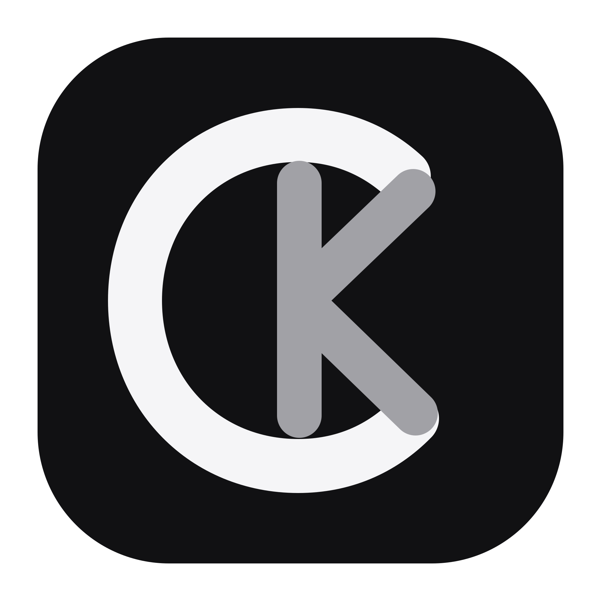
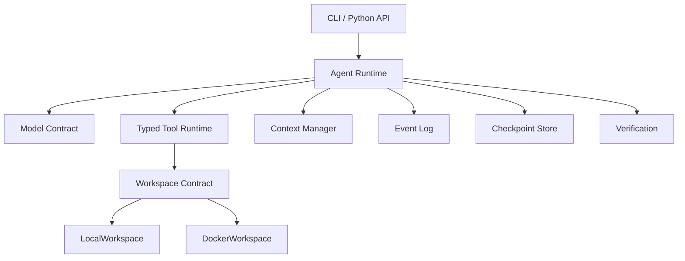

<p align="center">
  
</p>

<h1 align="center">CodeKeel</h1>

<p align="center">
  一个小巧、可检查、可扩展的编码智能体运行时。
</p>

---

[English](README.md) | [简体中文](README.zh-CN.md)

CodeKeel 将语言模型连接到代码仓库工具和有边界的工作区，并提供把简单的
“模型—工具”循环变成可靠编码智能体所需的运行能力：仓库上下文、类型化工具、
预算、审批控制、上下文管理、持久化轨迹、断点恢复，以及基于验证的完成判定。

```bash
codekeel run \
  --repo ./my-project \
  --task "修复失败的解析器测试" \
  --model deepseek/deepseek-v4-flash
```

## 为什么选择 CodeKeel？

能调用 shell 的模型只是编码智能体的起点。可用的 coding-agent harness 还需要
决定模型可以访问什么、让长任务保持在限制内、记录运行过程、安全恢复、暂停风险
操作，并验证最终结果。

CodeKeel 把这些问题设计为明确且可独立测试的组件：

- **小巧且可检查：** 线性控制循环，配合类型化状态和事件。
- **与模型提供方解耦：** Agent 依赖模型契约；内置适配器使用 LiteLLM。
- **基于工作区：** 工具通过工作区契约访问仓库，并提供本地和一次性 Docker 实现。
- **有明确边界：** 文件系统、shell、上下文、输出、步骤、时间、token 和成本均由可信
  运行时配置限制。
- **可持久化：** JSONL 事件和 SQLite 检查点支持检查运行记录，并从稳定步骤边界继续。
- **基于验证判定完成：** 配置的验证命令决定任务是否成功，而不是模型自己的声明。

## 快速开始

### 环境要求

- Python 3.12 或更高版本
- [uv](https://docs.astral.sh/uv/)
- Docker，仅在使用 Docker 工作区时需要

### 从源码安装

```bash
git clone https://github.com/Sakikoo0/codekeel codekeel
cd codekeel
uv sync
uv run codekeel --version
```

在 CodeKeel 尚未安装为系统命令时，请在下文命令前加上 `uv run`，例如
`uv run codekeel run ...`。

### 配置模型

CodeKeel 接受 LiteLLM 风格的模型标识，并使用模型提供方的常规环境配置。例如：

```bash
export DEEPSEEK_API_KEY="..."
# export OPENAI_API_KEY="..."
# export ANTHROPIC_API_KEY="..."
```

随后使用对应的 provider/model 标识，例如 `deepseek/deepseek-v4-flash`。

### 运行任务

开始运行前，先创建代码仓库目录和可信状态目录：

```bash
mkdir -p ./demo-repo ./.codekeel-state

codekeel run \
  --repo ./demo-repo \
  --root ./.codekeel-state \
  --model deepseek/deepseek-v4-flash \
  --task "创建 README.md，包含标题、简短的项目介绍和使用方法。"
```

`--repo` 是 Agent 可以检查和修改的代码仓库。`--root` 是 CodeKeel 保存检查点和
运行轨迹的可信宿主机目录。将两者分开，可以避免仓库工具把运行时状态当作普通项目
文件处理。

`run` 会输出一条 JSON 摘要，包含运行 ID、状态、资源用量、持续时间、验证结果、
轨迹路径，以及待审批操作 ID。

### 使用 Docker 工作区

```bash
codekeel run \
  --repo ./demo-repo \
  --root ./.codekeel-state \
  --workspace docker \
  --image python:3.12-slim \
  --model deepseek/deepseek-v4-flash \
  --task "修复失败的测试" \
  --verify "pytest"
```

Docker 工作区是一次性的，并且默认关闭网络。CLI 当前只能恢复已记录的本地工作区。

## CodeKeel 提供什么？

| 能力         | 用途                                             | 状态   |
| ------------ | ------------------------------------------------ | ------ |
| 模型适配器   | 通过模型契约调用 LiteLLM 兼容的模型提供方        | 已可用 |
| 类型化工具   | 读取、写入、编辑、列出、搜索、规划和运行受限命令 | 已可用 |
| 仓库上下文   | 在第一次模型请求前帮助 Agent 理解仓库            | 已可用 |
| 工作区       | 在本地仓库或一次性 Docker 容器中运行             | 已可用 |
| 上下文管理   | 限制工具输出并压缩长对话                         | 已可用 |
| 规划和探索   | 维护结构化计划，并委派只读探索任务               | 已可用 |
| 事件和检查点 | 检查运行过程，并从稳定步骤边界继续               | 已可用 |
| 审批策略     | 暂停特定操作，等待精确的人工决定                 | 已可用 |
| 验证循环     | 完成前要求可信命令全部通过                       | 已可用 |
| 评测框架     | 在可复现任务上比较不同配置                       | 规划中 |
| Agent Server | 通过 REST 和 WebSocket 暴露运行和事件            | 规划中 |

## CLI 概览

| 命令                                | 用途                         |
| ----------------------------------- | ---------------------------- |
| `codekeel run`                      | 启动新的非交互编码智能体任务 |
| `codekeel inspect RUN_ID`           | 以 JSON Lines 输出运行事件流 |
| `codekeel resume RUN_ID`            | 继续可恢复的本地运行         |
| `codekeel approve RUN_ID ACTION_ID` | 批准当前待处理的精确操作     |
| `codekeel reject RUN_ID ACTION_ID`  | 拒绝当前待处理的精确操作     |

使用 `codekeel COMMAND --help` 查看完整参数。

### 检查和恢复运行

```bash
codekeel inspect RUN_ID --root ./.codekeel-state
codekeel resume RUN_ID --root ./.codekeel-state
```

后续的检查、批准、拒绝和恢复命令必须使用与 `run` 相同的 `--root`。

### 批准或拒绝操作

默认的 `--approval risky` 模式会暂停高风险和未知操作。使用
`--approval always` 可以审核每一个原本允许的操作；使用 `--approval never`
可以非交互运行。所有模式下，硬性拒绝规则和工作区边界始终有效。

当运行返回 `waiting_for_approval` 时，先检查事件，再记录一次精确决定，然后恢复：

```bash
codekeel inspect RUN_ID --root ./.codekeel-state
codekeel approve RUN_ID ACTION_ID --root ./.codekeel-state
# 或：codekeel reject RUN_ID ACTION_ID --root ./.codekeel-state
codekeel resume RUN_ID --root ./.codekeel-state
```

批准或拒绝命令只记录决定；`resume` 才会继续执行。

## 架构



这些依赖边界是刻意设计的：Agent core 不直接依赖模型 SDK、Docker、subprocess、
SQLite 或 Web 框架。工具通过 `Workspace` 访问仓库；模型提供方实现 `Model` 契约。

## 核心概念

### Agent 循环

运行时维护线性对话：请求模型响应、验证并分派类型化工具调用、追加观察结果，然后重复，
直到完成或达到终止限制。明确的状态可以区分正常完成、等待审批、验证失败、预算耗尽、
取消、超时和运行时失败。

### 工具运行时

默认注册表提供结构化文件系统、搜索、shell 和规划工具；Python 调用方还可以挂载有边界
的只读 Explorer。工具参数在执行前经过验证，工具不能绕过所选工作区访问仓库。

### 工作区与沙箱模型

`LocalWorkspace` 适合可信仓库，但会直接在宿主机执行命令，因此不是沙箱。
`DockerWorkspace` 只挂载选定工作区，提供独立执行边界，并且默认关闭网络。

### 安全模型

文件操作实施工作区包含约束、符号链接感知检查、受保护路径和大小限制。Shell 执行使用
命令策略、输出限制、超时、工作区内工作目录和敏感环境变量过滤。Shell 策略是防护栏，
Docker 工作区才提供执行隔离；审批不会关闭任何一层边界。

### 上下文管理

大型工具结果在进入模型历史前会被缩减，必要时完整内容会写入工作区 artifact。长对话
可以使用确定性策略压缩，也可以选择摘要模型，同时保留任务和最近的完整轮次。

### 持久化与恢复

运行可以生成 append-only JSONL 事件，并把稳定状态持久化到 SQLite。继续运行时会恢复
消息、用量、限制、策略、计划和工作区元数据，同时不会重放已完成步骤。如果崩溃导致
某一步仍处于执行中，CodeKeel 会拒绝自动重放，因为重复外部操作可能不安全。

### 人工审批

审批与当前待处理的精确操作和持久化版本绑定。过期、重复、不匹配或跨运行的决定都会
失败关闭。拒绝结果会作为观察返回给模型，使其可以选择其他方案。

### 验证

重复使用 `--verify` 可以配置一组可信验证命令：

```bash
codekeel run \
  --repo ./my-project \
  --root ./.codekeel-state \
  --task "修复解析器" \
  --model provider/model \
  --verify "ruff check ." \
  --verify "pytest"
```

同一次尝试中的所有命令都必须通过。验证失败结果会返回给 Agent，让它在有限次数内修复
并重试。如果没有配置 `--verify`，完成结果会明确标记为未经验证。

## Python API

也可以直接组合 CodeKeel 组件：

```python
from codekeel.agent import Agent
from codekeel.models import LiteLLMModel
from codekeel.workspace import LocalWorkspace

workspace = LocalWorkspace("./my-project")
agent = Agent(LiteLLMModel("deepseek/deepseek-v4-flash"), workspace)

try:
    state = await agent.run("创建简洁的 CONTRIBUTING.md")
finally:
    await workspace.close()

print(state.status)
```

这些协议也支持自定义模型、工作区、工具、事件存储、检查点存储、上下文管理器、策略和
验证配置。

## 评测与 Benchmark

确定性评测框架和配置对比实验是接下来的路线图内容。评测将使用仓库 fixture、隔离运行、
持久化轨迹和验证结果作为 ground truth。只有实际完成对应实验后才会发布 benchmark
结果；CodeKeel 不会把模型的完成消息当作成功证据。

## 设计权衡

| 选择                       | 影响                                                   |
| -------------------------- | ------------------------------------------------------ |
| 显式协议                   | 组件可以独立替换和测试                                 |
| 线性控制循环               | 执行过程更容易检查、持久化和推理                       |
| 类型化工具                 | 边界更加清晰，但要求模型支持结构化工具调用             |
| 稳定步骤检查点             | 恢复不会重放已完成工作，但无法安全恢复所有执行中的操作 |
| 独立的本地和 Docker 工作区 | 用户可以在便利性和更强隔离之间选择                     |
| 基于验证判定完成           | 成功取决于配置的仓库检查，而不是模型的信心             |

## 已知限制

- CLI 只能恢复本地工作区。
- 被中断的执行中步骤需要人工检查，不能自动重放。
- `LocalWorkspace` 不是安全边界。
- 没有配置验证命令时，完成结果未经检查。
- CLI 当前不能提供权威的变更文件数量。
- 当前模型适配器要求结构化工具调用能力。
- 评测和 Server 命令尚未实现。

## 路线图

- [x] Agent core、模型契约和 LiteLLM 适配器
- [x] 类型化文件系统和 shell 工具
- [x] 本地和 Docker 工作区
- [x] 仓库上下文、输出限制和上下文压缩
- [x] 事件、检查点和安全恢复
- [x] 规划、只读探索、审批和验证
- [x] 统一的 `run`、`inspect`、`resume`、`approve` 和 `reject` CLI
- [ ] 确定性评测框架
- [ ] 配置对比 benchmark
- [ ] REST/WebSocket Agent Server
- [ ] benchmark 报告
- [ ] 多轮交互式终端会话，保留现有非交互 CLI

## 文档

详细指南和设计文档将重新整理到 `docs/`。计划包含模型配置、CLI 使用、Python 组合、
架构、工具、工作区、安全、上下文管理、持久化、审批、验证、评测、benchmark 和架构
决策等主题。

## 开发

```bash
uv sync
uv run ruff check .
uv run pytest
```

涉及 Docker 的改动需要在 Docker daemon 运行时执行：

```bash
uv run pytest -m docker
```
